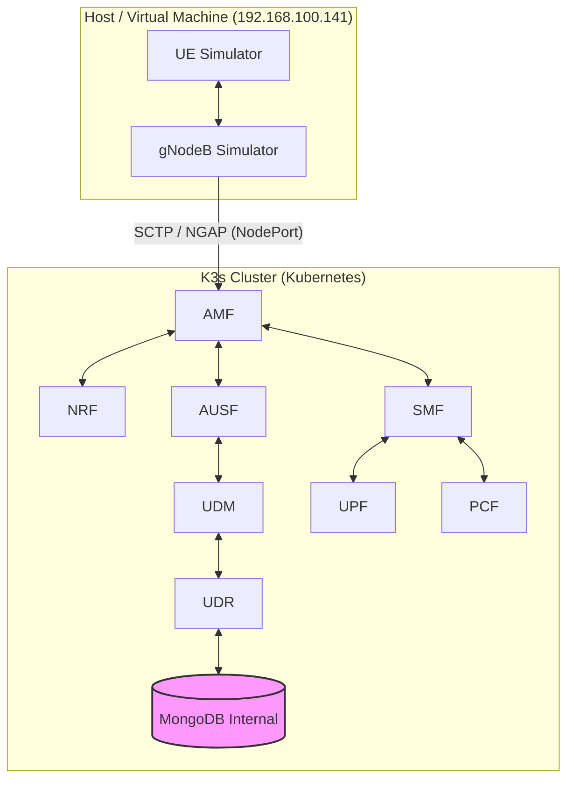
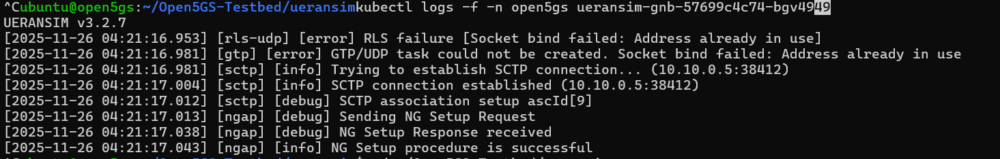
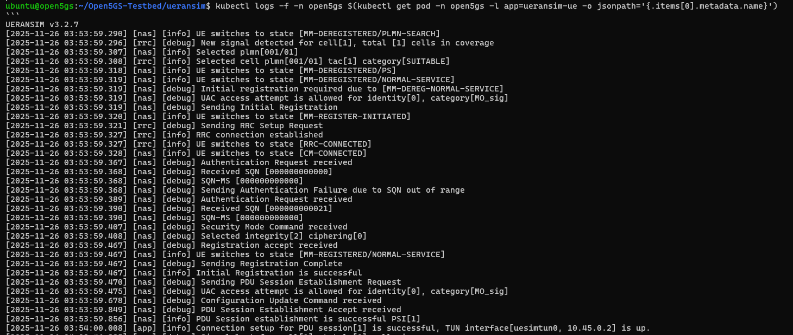
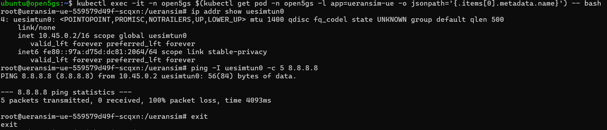
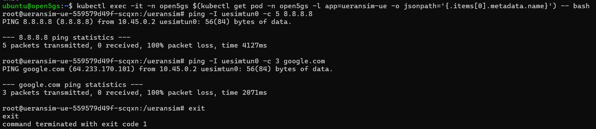
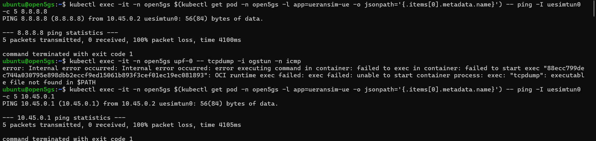

# 📡 5G Core Network Testbed (Open5GS + UERANSIM) on K3s


> **Laporan Proyek Akhir — Mata Kuliah Jaringan Nirkabel**
> Implementasi jaringan 5G Standalone (SA) menggunakan Kubernetes (K3s) dengan arsitektur hybrid: Core di Container, RAN di Host.

---

## 👥 Anggota Kelompok

| No | Nama                          | NIM             |
| -: | ----------------------------- | --------------- |
|  1 | **Muhammad Alden Prabaswara** | 235150201111014 |
|  2 | **Hanidura Ayatulloh**        | 225150207111005 |
|  3 | **Ni Nyoman Chandra P. I. W** | 225150207111106 |

---

## 📋 Overview

Repository ini menyediakan testbed 5G SA berbasis container dengan:

* **Open5GS 5G Core Network**
* **UERANSIM (UE & gNB Simulator)**
* **K3s Lightweight Kubernetes** dengan Calico
* **Network Slicing (eMBB, URLLC, mMTC)**

---

## 🏗️ Arsitektur Sistem



---

## 🎯 Fitur Utama

### Open5GS Components

Semua fungsi inti 5GC:

* AMF, SMF, UPF
* NRF, AUSF, UDM, UDR
* PCF, NSSF, SCP

### Network Slicing

| Slice | SST | DNN            | Subnet       | Use Case                 |
| ----- | --- | -------------- | ------------ | ------------------------ |
| eMBB  | 1   | `embb.testbed` | 10.45.0.0/24 | High-bandwidth broadband |
| URLLC | 2   | `urllc.v2x`    | 10.45.1.0/24 | Ultra-low latency / V2X  |
| mMTC  | 3   | `mmtc.testbed` | 10.45.2.0/24 | IoT / Massive devices    |

---

## 🚀 Instalasi & Setup

### Prasyarat

* Ubuntu 22.04 / 24.04
* 2 CPU / 4GB RAM
* K3s + Calico
* Sudo/root privileges

---

## Step 1 — Persiapan Sistem

```bash
sudo apt-get update && sudo apt-get upgrade -y
sudo apt-get install -y curl git iptables iptables-persistent net-tools \
    iputils-ping traceroute tcpdump wireshark libsctp1 lksctp-tools
```

### Install Docker & Containerd

```bash
sudo apt install ca-certificates curl
...
sudo apt install docker-ce docker-ce-cli containerd.io docker-buildx-plugin docker-compose-plugin
```

### Clone Repository

```bash
git clone https://github.com/rayhanegar/Open5GS-Testbed
cd Open5GS-Testbed
```

---

## Step 2 — Setup K3s Environment

```bash
cd open5gs/open5gs-k3s-calico
chmod +x setup-k3s-environment-calico.sh
sudo ./setup-k3s-environment-calico.sh
```

---

## Step 3 — Build Container Images

```bash
sed -i 's/docker build/sudo docker build/g' build-import-containers.sh
sed -i 's/docker save/sudo docker save/g' build-import-containers.sh
sed -i 's/k3s ctr/sudo k3s ctr/g' build-import-containers.sh

chmod +x build-import-containers.sh
sudo ./build-import-containers.sh
```

---

## Step 4 — Deploy Open5GS + MongoDB Internal

```bash
chmod +x deploy-k3s-calico.sh
sudo ./deploy-k3s-calico.sh
```

Hapus service lama & deploy MongoDB internal (script tetap sama).

Monitor:

```bash
kubectl get pods -n open5gs -w
```

---

## ⚙️ Konfigurasi & Testing

### 1. Registrasi Subscriber

```bash
kubectl exec -it -n open5gs mongodb-0 -- mongo open5gs
```

Masukkan JSON Subscriber (format tetap sama).
Restart AMF:

```bash
kubectl delete pod amf-0 -n open5gs
```

---

## 2. Menjalankan UERANSIM

### Konfigurasi IP Forwarding Host

```bash
sudo sysctl -w net.ipv4.ip_forward=1
sudo iptables -t nat -A POSTROUTING -s 10.45.0.0/16 ! -o ogstun -j MASQUERADE
sudo iptables -A FORWARD -i ogstun -j ACCEPT
sudo iptables -A FORWARD -o ogstun -j ACCEPT
```

### Terminal 1 — gNB

```bash
cd ~/Open5GS-Testbed/ueransim
./build/nr-gnb -c configs/open5gs-gnb-k3s.yaml
```

### Terminal 2 — UE

```bash
cd ~/Open5GS-Testbed/ueransim
sudo ./build/nr-ue -c configs/open5gs-ue-embb.yaml
```

---

# 🖥️ Hasil Eksekusi (Untuk Screenshot / Log)

Bagian berikut **disiapkan kosong** agar kamu bisa menaruh **SS Terminal 1, 2, dan 3** langsung di README repo GitHub.

---

## 📌 Terminal 1 — gNB (nr-gnb)



---

## 📌 Terminal 2 — UE (nr-ue)



---

## 📌 Terminal 3 — Monitoring / K3s / Logs Tambahan








## 📊 Performance Characteristics

| Metric            | Native    | Docker Compose | K3s Result |
| ----------------- | --------- | -------------- | ---------- |
| Registration Time | ~150 ms   | ~200 ms        | ~160 ms    |
| PDU Session Setup | ~100 ms   | ~150 ms        | ~180 ms    |
| eMBB Throughput   | 500+ Mbps | 450+ Mbps      | 400+ Mbps  |
| URLLC Latency     | ~15 ms    | ~20 ms         | ~25 ms     |

---

## 🔧 Troubleshooting

| Issue                    | Penyebab                 | Solusi                                    |
| ------------------------ | ------------------------ | ----------------------------------------- |
| CrashLoopBackOff PCF/UDR | MongoDB Host gagal konek | Gunakan MongoDB internal                  |
| Registration Rejected    | Subscriber JSON salah    | Tambahkan `pdu_session_type` & `ssc_mode` |
| gNB Refused              | IP binding salah         | Sesuaikan `linkIp`, `ngapIp`, `gtpIp`     |

---

## 📖 References

* Open5GS Docs
* UERANSIM Wiki
* 3GPP TS 23.501 / 24.501

---

**License:** GPL v3
**Maintainer:** aldnprbs

---
