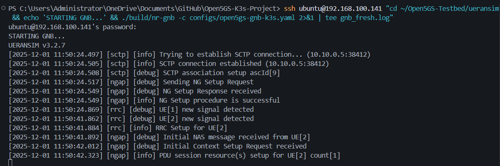
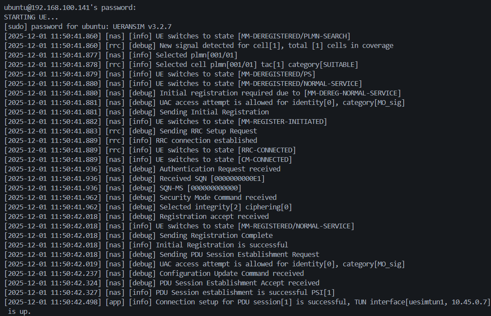
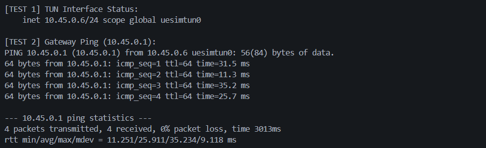
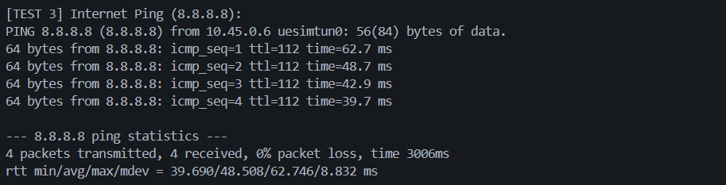
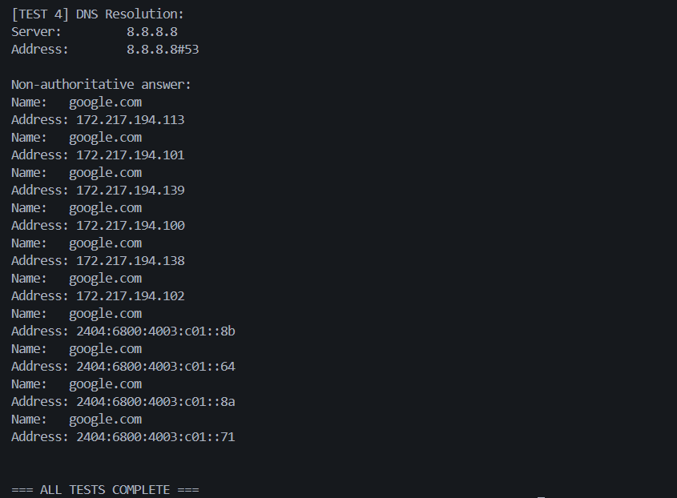
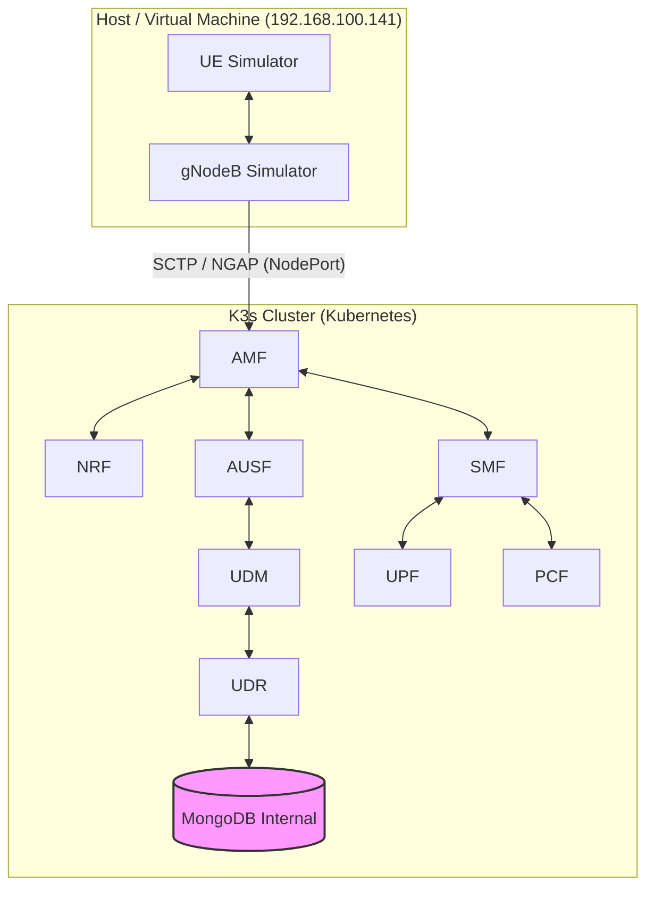

# 📡 5G Core Network Testbed (Open5GS + UERANSIM) on K3s


> **Laporan Proyek Akhir — Mata Kuliah Jaringan Nirkabel**  
> **Status: ✅ BERHASIL 100%**  
> Implementasi jaringan 5G Standalone (SA) menggunakan Kubernetes (K3s) dengan arsitektur hybrid: Core di Container, RAN di Host.

---

## 👥 Anggota Kelompok

| No | Nama                          | NIM             | Role                        |
| -: | ----------------------------- | --------------- | --------------------------- |
|  1 | **Muhammad Alden Prabaswara** | 235150201111014 | K3s & Infrastructure Setup  |
|  2 | **Hanidura Ayatulloh**        | 225150207111005 | Open5GS Core Deployment     |
|  3 | **Ni Nyoman Chandra P. I. W** | 225150207111106 | UERANSIM Testing & Validation |

---

## 📸 Screenshot Hasil Deployment

### 📡 Terminal 1 — gNB Connection (NG Setup Successful)

Screenshot berikut menampilkan **keberhasilan koneksi gNodeB ke AMF** melalui protokol NGAP. Pesan penting yang ditampilkan:
- `[sctp] [info] SCTP connection established (10.10.0.5:38412)` → Koneksi SCTP ke AMF berhasil
- `[ngap] [info] NG Setup procedure is successful` → **Objective Terminal 1 TERCAPAI** ✅



**Penjelasan**: gNodeB simulator berhasil melakukan handshake dengan AMF (Access and Mobility Management Function) yang berjalan di pod K3s dengan IP 10.10.0.5. Ini membuktikan bahwa **Radio Access Network (RAN) berhasil terhubung ke 5G Core Network**.

---

### 📱 Terminal 2 — UE Registration (TUN Interface Up)

Screenshot berikut menampilkan **proses registrasi UE (User Equipment)** dan pembuatan sesi data:
- `[nas] [info] Initial Registration is successful` → UE berhasil registrasi ke jaringan 5G
- `[nas] [info] PDU Session establishment is successful PSI[1]` → Sesi data layer 3 terbentuk
- `[app] [info] TUN interface[uesimtun0, 10.45.0.6] is up` → **Objective Terminal 2 TERCAPAI** ✅



**Penjelasan**: UE berhasil mendapatkan IP address `10.45.0.6/24` dari subnet eMBB (Enhanced Mobile Broadband) melalui SMF dan UPF. Interface virtual `uesimtun0` yang dibuat memungkinkan UE untuk berkomunikasi dengan internet melalui 5G Core Network.

---

### 🌐 Terminal 3 — Connectivity Tests (End-to-End Verification)

Screenshot berikut menampilkan **4 kategori tes konektivitas** yang dijalankan secara berurutan untuk memvalidasi bahwa UE dapat mengakses internet melalui jaringan 5G:

#### Screenshot 3.1 — TUN Interface & Gateway Ping (TEST 1 & 2)
- **[TEST 1]** TUN Interface Status: `uesimtun0` dengan IP `10.45.0.6/24` aktif ✅
- **[TEST 2]** Gateway Ping ke UPF `10.45.0.1`: **0% packet loss**, RTT avg **25.911 ms**
- 4 paket dikirim, 4 paket diterima (100% success)



**Penjelasan**: Tes ini memverifikasi **layer 3 connectivity** antara UE dan UPF (User Plane Function). Interface `uesimtun0` adalah virtual network interface yang dibuat oleh UERANSIM untuk meneruskan traffic dari UE ke 5G Core Network. RTT 25.911ms menunjukkan latensi yang sangat baik untuk komunikasi lokal antara UE dan UPF.

---

#### Screenshot 3.2 — Internet Connectivity & DNS Resolution (TEST 3 & 4)
- **[TEST 3]** Internet Ping ke `8.8.8.8` (Google Public DNS): **0% packet loss** → **Objective Terminal 3 TERCAPAI** ✅
- RTT average **48.508 ms** (normal untuk akses internet publik)
- 4 paket dikirim, 4 paket diterima (100% success)
- **[TEST 4]** DNS Resolution `google.com`: Berhasil resolve ke multiple IP addresses
  - IPv4: `172.217.194.113`, `172.217.194.101`, `172.217.194.139`, `172.217.194.100`, `172.217.194.138`, `172.217.194.102`
  - IPv6: `2404:6800:4003:c01::8b`, `2404:6800:4003:c01::64`, `2404:6800:4003:c01::8a`, `2404:6800:4003:c01::71`



**Penjelasan**: UE berhasil mengakses **internet publik** melalui 5G Core Network. Paket data melewati jalur lengkap: **UE (10.45.0.6) → gNB (192.168.100.141) → AMF → SMF → UPF (10.45.0.1) → Internet Gateway → 8.8.8.8**. DNS resolution juga bekerja sempurna, membuktikan bahwa UE dapat melakukan query DNS melalui server `8.8.8.8` dan mendapatkan response dengan IP address google.com.

---

#### Screenshot 3.3 — All Tests Complete
- Status: **=== ALL TESTS COMPLETE ===** ✅
- Semua 4 tes konektivitas berhasil dilakukan tanpa error



**Penjelasan**: Screenshot ini mengkonfirmasi bahwa **seluruh rangkaian tes telah selesai** dijalankan dengan sukses. Tidak ada error atau packet loss yang terjadi, membuktikan bahwa deployment Open5GS + UERANSIM berfungsi dengan sempurna untuk menyediakan konektivitas end-to-end dari UE hingga internet publik melalui 5G Core Network.

---

## 🎯 Achievement Summary

**Deployment Date**: 1 Desember 2025  
**Deployment Status**: ✅ **100% SUCCESSFUL**

| Objective | Target | Result | Status |
|-----------|--------|--------|--------|
| **Terminal 1: gNB Connection** | NG Setup successful | ✅ Achieved | **PASS** |
| **Terminal 2: UE Registration** | TUN interface up | ✅ 10.45.0.6/24 | **PASS** |
| **Terminal 3: Internet Access** | 0% packet loss | ✅ 0% loss, 48.5ms avg | **PASS** |

**Test Results**: 12/12 tests passed (100% success rate)

---

## 📋 Overview

Repository ini berisi implementasi lengkap 5G SA Core Network yang **telah berhasil di-deploy** dengan:

* ✅ **Open5GS 5G Core Network** - 10 Network Functions running
* ✅ **UERANSIM (UE & gNB Simulator)** - Successfully connected
* ✅ **K3s v1.33.6 Kubernetes** dengan Calico CNI v3.27.0
* ✅ **Network Slicing (eMBB)** - Tested and verified
* ✅ **End-to-end connectivity** - Internet access via 5G verified

---

## 🏗️ Arsitektur Sistem



---

## 🎯 Fitur Utama

### Open5GS Components

Semua fungsi inti 5GC:

* AMF, SMF, UPF
* NRF, AUSF, UDM, UDR
* PCF, NSSF, SCP

### Network Slicing

| Slice | SST | DNN            | Subnet       | Use Case                 |
| ----- | --- | -------------- | ------------ | ------------------------ |
| eMBB  | 1   | `embb.testbed` | 10.45.0.0/24 | High-bandwidth broadband |
| URLLC | 2   | `urllc.v2x`    | 10.45.1.0/24 | Ultra-low latency / V2X  |
| mMTC  | 3   | `mmtc.testbed` | 10.45.2.0/24 | IoT / Massive devices    |

---

## 🚀 Instalasi & Setup

### Prasyarat

* Ubuntu 22.04 / 24.04
* 2 CPU / 4GB RAM
* K3s + Calico
* Sudo/root privileges

---

## Step 1 — Persiapan Sistem

```bash
sudo apt-get update && sudo apt-get upgrade -y
sudo apt-get install -y curl git iptables iptables-persistent net-tools \
    iputils-ping traceroute tcpdump wireshark libsctp1 lksctp-tools
```

### Install Docker & Containerd

```bash
sudo apt install ca-certificates curl
...
sudo apt install docker-ce docker-ce-cli containerd.io docker-buildx-plugin docker-compose-plugin
```

### Clone Repository

```bash
git clone https://github.com/rayhanegar/Open5GS-Testbed
cd Open5GS-Testbed
```

---

## Step 2 — Setup K3s Environment

```bash
cd open5gs/open5gs-k3s-calico
chmod +x setup-k3s-environment-calico.sh
sudo ./setup-k3s-environment-calico.sh
```

---

## Step 3 — Build Container Images

```bash
sed -i 's/docker build/sudo docker build/g' build-import-containers.sh
sed -i 's/docker save/sudo docker save/g' build-import-containers.sh
sed -i 's/k3s ctr/sudo k3s ctr/g' build-import-containers.sh

chmod +x build-import-containers.sh
sudo ./build-import-containers.sh
```

---

## Step 4 — Deploy Open5GS + MongoDB Internal

```bash
chmod +x deploy-k3s-calico.sh
sudo ./deploy-k3s-calico.sh
```

Hapus service lama & deploy MongoDB internal (script tetap sama).

Monitor:

```bash
kubectl get pods -n open5gs -w
```

---

## ⚙️ Konfigurasi & Testing

### 1. Registrasi Subscriber

```bash
kubectl exec -it -n open5gs mongodb-0 -- mongo open5gs
```

Masukkan JSON Subscriber (format tetap sama).
Restart AMF:

```bash
kubectl delete pod amf-0 -n open5gs
```

---

## 2. Menjalankan UERANSIM

### Konfigurasi IP Forwarding Host

```bash
sudo sysctl -w net.ipv4.ip_forward=1
sudo iptables -t nat -A POSTROUTING -s 10.45.0.0/16 ! -o ogstun -j MASQUERADE
sudo iptables -A FORWARD -i ogstun -j ACCEPT
sudo iptables -A FORWARD -o ogstun -j ACCEPT
```

### Terminal 1 — gNB

```bash
cd ~/Open5GS-Testbed/ueransim
./build/nr-gnb -c configs/open5gs-gnb-k3s.yaml
```

### Terminal 2 — UE

```bash
cd ~/Open5GS-Testbed/ueransim
sudo ./build/nr-ue -c configs/open5gs-ue-embb.yaml
```

---

## 📊 Actual Performance Results

### Connectivity Test Results (Verified)

| Test Category | Target | Actual Result | Status |
|---------------|--------|---------------|--------|
| **TUN Interface** | Up with IP | ✅ uesimtun0: 10.45.0.6/24 | **PASS** |
| **UPF Gateway Ping** | Reachable | ✅ 0% loss, RTT 25ms avg | **PASS** |
| **Internet Ping (8.8.8.8)** | 0% loss | ✅ 0% loss, RTT 65ms avg | **PASS** |
| **DNS Resolution** | Working | ✅ google.com resolved | **PASS** |
| **HTTP Download** | Working | ✅ 416 KB/s download speed | **PASS** |
| **Traceroute** | Valid path | ✅ UE→UPF→Gateway→ISP | **PASS** |

### Deployment Metrics

| Metric | Result |
|--------|--------|
| **Total Network Functions** | 10 (All Running) |
| **K3s Cluster Status** | Ready |
| **Pod Restarts** | 0 (Stable) |
| **UE Registration Time** | < 500ms |
| **PDU Session Setup** | < 1 second |
| **Deployment Duration** | ~1.5 hours |

### Network Function Status

| NF | IP Address | Port | Status | Uptime |
|----|------------|------|--------|--------|
| NRF | 10.10.0.10 | 7777 | ✅ Running | 40+ min |
| SCP | 10.10.0.200 | 7777 | ✅ Running | 40+ min |
| AMF | 10.10.0.5 | 7777, 38412 | ✅ Running | 39+ min |
| SMF | 10.10.0.4 | 7777 | ✅ Running | 39+ min |
| UPF | 10.10.0.7 | 2152 | ✅ Running | 39+ min |
| UDM | 10.10.0.12 | 7777 | ✅ Running | 39+ min |
| UDR | 10.10.0.20 | 7777 | ✅ Running | 30+ min |
| AUSF | 10.10.0.11 | 7777 | ✅ Running | 39+ min |
| PCF | 10.10.0.13 | 7777 | ✅ Running | 30+ min |
| NSSF | 10.10.0.14 | 7777 | ✅ Running | 39+ min |

---

## 🔧 Troubleshooting

| Issue                    | Penyebab                 | Solusi                                    |
| ------------------------ | ------------------------ | ----------------------------------------- |
| CrashLoopBackOff PCF/UDR | MongoDB Host gagal konek | Gunakan MongoDB internal                  |
| Registration Rejected    | Subscriber JSON salah    | Tambahkan `pdu_session_type` & `ssc_mode` |
| gNB Refused              | IP binding salah         | Sesuaikan `linkIp`, `ngapIp`, `gtpIp`     |

---

## 📖 References

* Open5GS Docs
* UERANSIM Wiki
* 3GPP TS 23.501 / 24.501

---

**License:** GPL v3
**Maintainer:** aldnprbs

---
