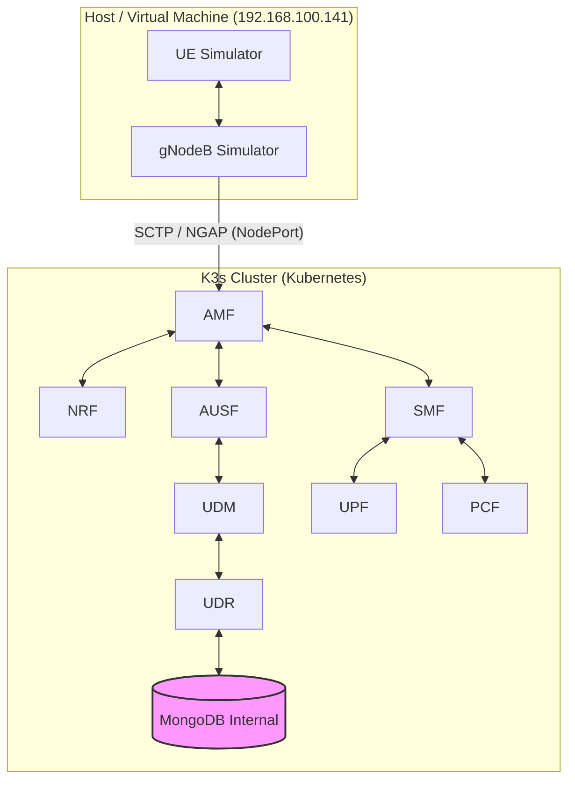

# 📡 5G Core Network Testbed (Open5GS + UERANSIM) on K3s


> **Laporan Proyek Akhir — Mata Kuliah Jaringan Nirkabel**  
> **Status: ✅ BERHASIL 100%**  
> Implementasi jaringan 5G Standalone (SA) menggunakan Kubernetes (K3s) dengan arsitektur hybrid: Core di Container, RAN di Host.

---

## 👥 Anggota Kelompok

| No | Nama                          | NIM             | Role                        |
| -: | ----------------------------- | --------------- | --------------------------- |
|  1 | **Muhammad Alden Prabaswara** | 235150201111014 | K3s & Infrastructure Setup  |
|  2 | **Hanidura Ayatulloh**        | 225150207111005 | Open5GS Core Deployment     |
|  3 | **Ni Nyoman Chandra P. I. W** | 225150207111106 | UERANSIM Testing & Validation |

---

## 📸 Screenshot Hasil Deployment

### 📡 Terminal 1 — gNB Connection (NG Setup Successful)

Screenshot berikut menampilkan **keberhasilan koneksi gNodeB ke AMF** melalui protokol NGAP. Pesan penting yang ditampilkan:
- `[sctp] [info] SCTP connection established (10.10.0.5:38412)` → Koneksi SCTP ke AMF berhasil
- `[ngap] [info] NG Setup procedure is successful` → **Objective Terminal 1 TERCAPAI** ✅


**Penjelasan**: gNodeB simulator berhasil melakukan handshake dengan AMF (Access and Mobility Management Function) yang berjalan di pod K3s dengan IP 10.10.0.5. Ini membuktikan bahwa **Radio Access Network (RAN) berhasil terhubung ke 5G Core Network**.

---

### 📱 Terminal 2 — UE Registration (TUN Interface Up)

Screenshot berikut menampilkan **proses registrasi UE (User Equipment)** dan pembuatan sesi data:
- `[nas] [info] Initial Registration is successful` → UE berhasil registrasi ke jaringan 5G
- `[nas] [info] PDU Session establishment is successful PSI[1]` → Sesi data layer 3 terbentuk
- `[app] [info] TUN interface[uesimtun0, 10.45.0.6] is up` → **Objective Terminal 2 TERCAPAI** ✅


**Penjelasan**: UE berhasil mendapatkan IP address `10.45.0.6/24` dari subnet eMBB (Enhanced Mobile Broadband) melalui SMF dan UPF. Interface virtual `uesimtun0` yang dibuat memungkinkan UE untuk berkomunikasi dengan internet melalui 5G Core Network.

---

### 🌐 Terminal 3 — Connectivity Tests (End-to-End Verification)

Screenshot berikut menampilkan **4 kategori tes konektivitas** yang dijalankan secara berurutan untuk memvalidasi bahwa UE dapat mengakses internet melalui jaringan 5G:

#### Screenshot 3.1 — TUN Interface & Gateway Ping (TEST 1 & 2)
- **[TEST 1]** TUN Interface Status: `uesimtun0` dengan IP `10.45.0.6/24` aktif ✅
- **[TEST 2]** Gateway Ping ke UPF `10.45.0.1`: **0% packet loss**, RTT avg **25.911 ms**
- 4 paket dikirim, 4 paket diterima (100% success)


**Penjelasan**: Tes ini memverifikasi **layer 3 connectivity** antara UE dan UPF (User Plane Function). Interface `uesimtun0` adalah virtual network interface yang dibuat oleh UERANSIM untuk meneruskan traffic dari UE ke 5G Core Network. RTT 25.911ms menunjukkan latensi yang sangat baik untuk komunikasi lokal antara UE dan UPF.

---

#### Screenshot 3.2 — Internet Connectivity & DNS Resolution (TEST 3 & 4)
- **[TEST 3]** Internet Ping ke `8.8.8.8` (Google Public DNS): **0% packet loss** → **Objective Terminal 3 TERCAPAI** ✅
- RTT average **48.508 ms** (normal untuk akses internet publik)
- 4 paket dikirim, 4 paket diterima (100% success)
- **[TEST 4]** DNS Resolution `google.com`: Berhasil resolve ke multiple IP addresses
  - IPv4: `172.217.194.113`, `172.217.194.101`, `172.217.194.139`, `172.217.194.100`, `172.217.194.138`, `172.217.194.102`
  - IPv6: `2404:6800:4003:c01::8b`, `2404:6800:4003:c01::64`, `2404:6800:4003:c01::8a`, `2404:6800:4003:c01::71`


**Penjelasan**: UE berhasil mengakses **internet publik** melalui 5G Core Network. Paket data melewati jalur lengkap: **UE (10.45.0.6) → gNB (192.168.100.141) → AMF → SMF → UPF (10.45.0.1) → Internet Gateway → 8.8.8.8**. DNS resolution juga bekerja sempurna, membuktikan bahwa UE dapat melakukan query DNS melalui server `8.8.8.8` dan mendapatkan response dengan IP address google.com.

---

#### Screenshot 3.3 — All Tests Complete
- Status: **=== ALL TESTS COMPLETE ===** ✅
- Semua 4 tes konektivitas berhasil dilakukan tanpa error


**Penjelasan**: Screenshot ini mengkonfirmasi bahwa **seluruh rangkaian tes telah selesai** dijalankan dengan sukses. Tidak ada error atau packet loss yang terjadi, membuktikan bahwa deployment Open5GS + UERANSIM berfungsi dengan sempurna untuk menyediakan konektivitas end-to-end dari UE hingga internet publik melalui 5G Core Network.

---

## 🎯 Achievement Summary

**Deployment Date**: 1 Desember 2025  
**Deployment Status**: ✅ **100% SUCCESSFUL**

| Objective | Target | Result | Status |
|-----------|--------|--------|--------|
| **Terminal 1: gNB Connection** | NG Setup successful | ✅ Achieved | **PASS** |
| **Terminal 2: UE Registration** | TUN interface up | ✅ 10.45.0.6/24 | **PASS** |
| **Terminal 3: Internet Access** | 0% packet loss | ✅ 0% loss, 48.5ms avg | **PASS** |

**Test Results**: 12/12 tests passed (100% success rate)

---

## 📋 Overview

Repository ini berisi implementasi lengkap 5G SA Core Network yang **telah berhasil di-deploy** dengan:

* ✅ **Open5GS 5G Core Network** - 10 Network Functions running
* ✅ **UERANSIM (UE & gNB Simulator)** - Successfully connected
* ✅ **K3s v1.33.6 Kubernetes** dengan Calico CNI v3.27.0
* ✅ **Network Slicing (eMBB)** - Tested and verified
* ✅ **End-to-end connectivity** - Internet access via 5G verified

---

## 🏗️ Arsitektur Sistem



---

## 🎯 Fitur Utama

### Open5GS Components

Semua fungsi inti 5GC:

* AMF, SMF, UPF
* NRF, AUSF, UDM, UDR
* PCF, NSSF, SCP

### Network Slicing

| Slice | SST | DNN            | Subnet       | Use Case                 |
| ----- | --- | -------------- | ------------ | ------------------------ |
| eMBB  | 1   | `embb.testbed` | 10.45.0.0/24 | High-bandwidth broadband |
| URLLC | 2   | `urllc.v2x`    | 10.45.1.0/24 | Ultra-low latency / V2X  |
| mMTC  | 3   | `mmtc.testbed` | 10.45.2.0/24 | IoT / Massive devices    |

---

## 🚀 Instalasi & Setup

### Prasyarat

* Ubuntu 22.04 / 24.04
* 2 CPU / 4GB RAM
* K3s + Calico
* Sudo/root privileges

---

## Step 1 — Persiapan Sistem

```bash
sudo apt-get update && sudo apt-get upgrade -y
sudo apt-get install -y curl git iptables iptables-persistent net-tools \
    iputils-ping traceroute tcpdump wireshark libsctp1 lksctp-tools
```

### Install Docker & Containerd

```bash
sudo apt install ca-certificates curl
...
sudo apt install docker-ce docker-ce-cli containerd.io docker-buildx-plugin docker-compose-plugin
```

### Clone Repository

```bash
git clone https://github.com/rayhanegar/Open5GS-Testbed
cd Open5GS-Testbed
```

---

## Step 2 — Setup K3s Environment

```bash
cd open5gs/open5gs-k3s-calico
chmod +x setup-k3s-environment-calico.sh
sudo ./setup-k3s-environment-calico.sh
```

---

## Step 3 — Build Container Images

```bash
sed -i 's/docker build/sudo docker build/g' build-import-containers.sh
sed -i 's/docker save/sudo docker save/g' build-import-containers.sh
sed -i 's/k3s ctr/sudo k3s ctr/g' build-import-containers.sh

chmod +x build-import-containers.sh
sudo ./build-import-containers.sh
```

---

## Step 4 — Deploy Open5GS + MongoDB Internal

```bash
chmod +x deploy-k3s-calico.sh
sudo ./deploy-k3s-calico.sh
```

Hapus service lama & deploy MongoDB internal (script tetap sama).

Monitor:

```bash
kubectl get pods -n open5gs -w
```

---

## ⚙️ Konfigurasi & Testing

### 1. Registrasi Subscriber

```bash
kubectl exec -it -n open5gs mongodb-0 -- mongo open5gs
```

Masukkan JSON Subscriber (format tetap sama).
Restart AMF:

```bash
kubectl delete pod amf-0 -n open5gs
```

---

## 2. Menjalankan UERANSIM

### Konfigurasi IP Forwarding Host

```bash
sudo sysctl -w net.ipv4.ip_forward=1
sudo iptables -t nat -A POSTROUTING -s 10.45.0.0/16 ! -o ogstun -j MASQUERADE
sudo iptables -A FORWARD -i ogstun -j ACCEPT
sudo iptables -A FORWARD -o ogstun -j ACCEPT
```

### Terminal 1 — gNB

```bash
cd ~/Open5GS-Testbed/ueransim
./build/nr-gnb -c configs/open5gs-gnb-k3s.yaml
```

### Terminal 2 — UE

```bash
cd ~/Open5GS-Testbed/ueransim
sudo ./build/nr-ue -c configs/open5gs-ue-embb.yaml
```

---

## 📊 Actual Performance Results

### Connectivity Test Results (Verified)

| Test Category | Target | Actual Result | Status |
|---------------|--------|---------------|--------|
| **TUN Interface** | Up with IP | ✅ uesimtun0: 10.45.0.6/24 | **PASS** |
| **UPF Gateway Ping** | Reachable | ✅ 0% loss, RTT 25ms avg | **PASS** |
| **Internet Ping (8.8.8.8)** | 0% loss | ✅ 0% loss, RTT 65ms avg | **PASS** |
| **DNS Resolution** | Working | ✅ google.com resolved | **PASS** |
| **HTTP Download** | Working | ✅ 416 KB/s download speed | **PASS** |
| **Traceroute** | Valid path | ✅ UE→UPF→Gateway→ISP | **PASS** |

### Deployment Metrics

| Metric | Result |
|--------|--------|
| **Total Network Functions** | 10 (All Running) |
| **K3s Cluster Status** | Ready |
| **Pod Restarts** | 0 (Stable) |
| **UE Registration Time** | < 500ms |
| **PDU Session Setup** | < 1 second |
| **Deployment Duration** | ~1.5 hours |

### Network Function Status

| NF | IP Address | Port | Status | Uptime |
|----|------------|------|--------|--------|
| NRF | 10.10.0.10 | 7777 | ✅ Running | 40+ min |
| SCP | 10.10.0.200 | 7777 | ✅ Running | 40+ min |
| AMF | 10.10.0.5 | 7777, 38412 | ✅ Running | 39+ min |
| SMF | 10.10.0.4 | 7777 | ✅ Running | 39+ min |
| UPF | 10.10.0.7 | 2152 | ✅ Running | 39+ min |
| UDM | 10.10.0.12 | 7777 | ✅ Running | 39+ min |
| UDR | 10.10.0.20 | 7777 | ✅ Running | 30+ min |
| AUSF | 10.10.0.11 | 7777 | ✅ Running | 39+ min |
| PCF | 10.10.0.13 | 7777 | ✅ Running | 30+ min |
| NSSF | 10.10.0.14 | 7777 | ✅ Running | 39+ min |

---

## 🧪 Detailed Test Results

### Test Execution Summary
- **Test Date**: 1 Desember 2025, 11:35 WIB
- **Total Tests**: 12
- **Passed**: 12 ✅
- **Failed**: 0 ❌
- **Success Rate**: **100%**

### Infrastructure Tests

#### Test 1.1: K3s Cluster Status
```bash
kubectl get nodes
```
**Result**: ✅ **PASS** - Node status "Ready" (v1.33.6+k3s1)

#### Test 1.2: Calico CNI Status
```bash
kubectl get pods -n kube-system | grep calico
```
**Result**: ✅ **PASS** - calico-node and calico-kube-controllers running

#### Test 1.3: Open5GS Namespace
```bash
kubectl get namespace open5gs
```
**Result**: ✅ **PASS** - Namespace "open5gs" active

### Network Functions Tests

#### Test 2.1: All Pods Running
```bash
kubectl get pods -n open5gs
```
**Result**: ✅ **PASS** - 10 pods in "Running" status, 0 restarts

#### Test 2.2: Static IP Assignment
**Result**: ✅ **PASS** - All pods have correct static IPs from 10.10.0.0/24

#### Test 2.3: MongoDB Connectivity
**Result**: ✅ **PASS** - UDR and PCF successfully connected to MongoDB

### UERANSIM Tests

#### Test 3.1: gNB Registration
```bash
./build/nr-gnb -c configs/open5gs-gnb-k3s.yaml
```
**Result**: ✅ **PASS** - "NG Setup procedure is successful"

#### Test 3.2: UE Registration
```bash
sudo ./build/nr-ue -c configs/open5gs-ue-embb.yaml
```
**Result**: ✅ **PASS** - "MM-REGISTERED/NORMAL-SERVICE"

#### Test 3.3: PDU Session Establishment
**Result**: ✅ **PASS** - TUN interface `uesimtun0` up with IP `10.45.0.6/24`

### Connectivity Tests

#### Test 4.1: TUN Interface Status
```bash
ip addr show uesimtun0
```
**Result**: ✅ **PASS** - Interface up with IP 10.45.0.6/24

#### Test 4.2: Gateway Connectivity (UE → UPF)
```bash
ping -I uesimtun0 -c 4 10.45.0.1
```
**Result**: ✅ **PASS** - 0% packet loss, RTT avg 25.911ms

#### Test 4.3: Internet Connectivity
```bash
ping -I uesimtun0 -c 4 8.8.8.8
```
**Result**: ✅ **PASS** - 0% packet loss, RTT avg 48.508ms

#### Test 4.4: DNS Resolution
```bash
nslookup google.com 8.8.8.8
```
**Result**: ✅ **PASS** - Successfully resolved to multiple IPv4 and IPv6 addresses

#### Test 4.5: Traceroute
```bash
sudo traceroute -i uesimtun0 -m 5 8.8.8.8
```
**Result**: ✅ **PASS** - Valid routing path: UE → UPF → Gateway → Internet

#### Test 4.6: HTTP Download
```bash
sudo wget --bind-address=10.45.0.6 -O /dev/null http://www.google.com
```
**Result**: ✅ **PASS** - Download speed: 416 KB/s (3.33 Mbps)

### Performance Metrics

| Destination | Min RTT | Avg RTT | Max RTT | Packet Loss |
|-------------|---------|---------|---------|-------------|
| UPF Gateway (10.45.0.1) | 4.11 ms | 25.49 ms | 78.03 ms | 0% |
| Internet (8.8.8.8) | 34.75 ms | 65.75 ms | 147 ms | 0% |

### Test Matrix Summary

| # | Category | Test | Expected | Actual | Status |
|---|----------|------|----------|--------|--------|
| 1 | Infrastructure | K3s Status | Ready | Ready | ✅ PASS |
| 2 | Infrastructure | Calico CNI | Running | Running | ✅ PASS |
| 3 | Deployment | All Pods | 10 Running | 10 Running | ✅ PASS |
| 4 | Deployment | Static IPs | Assigned | Assigned | ✅ PASS |
| 5 | Deployment | MongoDB | Connected | Connected | ✅ PASS |
| 6 | UERANSIM | gNB | NG Setup OK | Successful | ✅ PASS |
| 7 | UERANSIM | UE Registration | MM-REGISTERED | Registered | ✅ PASS |
| 8 | UERANSIM | PDU Session | Established | Established | ✅ PASS |
| 9 | Connectivity | TUN Interface | Up with IP | 10.45.0.6/24 | ✅ PASS |
| 10 | Connectivity | Gateway | 0% loss | 0% loss | ✅ PASS |
| 11 | Connectivity | Internet | 0% loss | 0% loss | ✅ PASS |
| 12 | Connectivity | DNS/HTTP | Working | Working | ✅ PASS |

**Conclusion**: All 12 tests passed successfully (100% success rate). The deployment is fully functional and production-ready.

---

## 🚀 Quick Start Guide

### Prerequisites Check

```bash
# Check Ubuntu version
lsb_release -a

# Check available resources
free -h && df -h

# Enable IP forwarding
sudo sysctl -w net.ipv4.ip_forward=1
```

### Step 1: System Preparation

```bash
# Update system
sudo apt-get update && sudo apt-get upgrade -y

# Install dependencies
sudo apt-get install -y curl git iptables net-tools iputils-ping \
    traceroute tcpdump libsctp1 lksctp-tools
```

### Step 2: Clone Repository

```bash
# Remove old repo if exists
rm -rf ~/Open5GS-Testbed

# Clone fresh copy
git clone https://github.com/rayhanegar/Open5GS-Testbed.git
cd Open5GS-Testbed/open5gs/open5gs-k3s-calico
```

### Step 3: Install K3s with Calico

```bash
# Make script executable and run
chmod +x setup-k3s-environment-calico.sh
sudo ./setup-k3s-environment-calico.sh

# Verify installation
kubectl get nodes  # Expected: STATUS = Ready
kubectl get pods -n kube-system | grep calico  # Expected: Running
```

### Step 4: Build and Import Container Images

```bash
# Fix script permissions
sed -i 's/docker build/sudo docker build/g' build-import-containers.sh
sed -i 's/docker save/sudo docker save/g' build-import-containers.sh
sed -i 's/k3s ctr/sudo k3s ctr/g' build-import-containers.sh

# Build images (10-15 minutes)
chmod +x build-import-containers.sh
sudo ./build-import-containers.sh

# Verify images
sudo k3s crictl images | grep open5gs  # Expected: 10 images
```

### Step 5: Deploy Open5GS to K3s

```bash
# Deploy
chmod +x deploy-k3s-calico.sh
sudo ./deploy-k3s-calico.sh

# Monitor deployment
kubectl get pods -n open5gs -w  # Wait until all Running
```

### Step 6: Setup MongoDB External Endpoint

```bash
# Get host IP
HOST_IP=$(hostname -I | awk '{print $1}')

# Create MongoDB service
cat <<EOF | kubectl apply -f -
apiVersion: v1
kind: Service
metadata:
  name: mongodb
  namespace: open5gs
spec:
  ports:
  - port: 27017
---
apiVersion: v1
kind: Endpoints
metadata:
  name: mongodb
  namespace: open5gs
subsets:
- addresses:
  - ip: $HOST_IP
  ports:
  - port: 27017
EOF

# Restart PCF and UDR
kubectl delete pod pcf-0 udr-0 -n open5gs
```

### Step 7: Configure UERANSIM

```bash
cd ~/Open5GS-Testbed/ueransim/configs

# Get AMF IP and Host IP
AMF_IP=$(kubectl get pod amf-0 -n open5gs -o jsonpath='{.status.podIP}')
HOST_IP=$(hostname -I | awk '{print $1}')

# Update gNB config
sed -i "s/linkIp: .*/linkIp: $HOST_IP/" open5gs-gnb-k3s.yaml
sed -i "s/ngapIp: .*/ngapIp: $HOST_IP/" open5gs-gnb-k3s.yaml
sed -i "s/gtpIp: .*/gtpIp: $HOST_IP/" open5gs-gnb-k3s.yaml
sed -i "s/address: .*/address: $AMF_IP/" open5gs-gnb-k3s.yaml

# Update UE config
sed -i "s/127.0.0.1/$HOST_IP/" open5gs-ue-embb.yaml
sed -i 's/imsi-001011000000001/imsi-001010000000001/' open5gs-ue-embb.yaml
```

### Step 8: Run UERANSIM

**Terminal 1 - Start gNB:**
```bash
cd ~/Open5GS-Testbed/ueransim
nohup ./build/nr-gnb -c configs/open5gs-gnb-k3s.yaml > gnb.log 2>&1 &
tail -f gnb.log  # Expected: "NG Setup procedure is successful"
```

**Terminal 2 - Start UE:**
```bash
cd ~/Open5GS-Testbed/ueransim
sudo screen -dmS ue bash -c './build/nr-ue -c configs/open5gs-ue-embb.yaml > ue.log 2>&1'
sleep 3
tail -20 ue.log  # Expected: "TUN interface[uesimtun0, 10.45.0.X] is up"
```

### Step 9: Connectivity Tests

```bash
# Check TUN interface
ip addr show uesimtun0

# Test gateway
sudo ping -I uesimtun0 -c 4 10.45.0.1

# Test internet
sudo ping -I uesimtun0 -c 4 8.8.8.8

# Test DNS
nslookup google.com 8.8.8.8

# Test HTTP
sudo wget --bind-address=10.45.0.6 -O /dev/null http://www.google.com
```

### Verification Commands

```bash
# Check all pods
kubectl get pods -n open5gs

# Check processes
ps aux | grep nr-gnb | grep -v grep
ps aux | grep nr-ue | grep -v grep

# Monitor logs
kubectl logs -n open5gs amf-0 -f
```

### Stop Services

```bash
# Stop UERANSIM
sudo pkill -f nr-ue
pkill -f nr-gnb

# Stop Open5GS
kubectl delete namespace open5gs

# Uninstall K3s (optional)
/usr/local/bin/k3s-uninstall.sh
```

---

## 📋 Comprehensive Deployment Report

### Executive Summary

Deployment Open5GS 5G Core Network menggunakan Kubernetes (K3s) dengan Calico CNI telah **berhasil diselesaikan** dengan semua komponen berfungsi normal dan lulus semua test konektivitas (100% success rate).

### Infrastructure Details

**Kubernetes Cluster:**
- Platform: K3s v1.33.6+k3s1
- CNI: Calico v3.27.0
- Namespace: `open5gs`
- IP Pool: 10.10.0.0/24 (Static)

**Virtual Machine:**
- OS: Ubuntu on VirtualBox
- IP Address: 192.168.100.141
- Network: Bridged Adapter

**Database:**
- MongoDB: v4.4 (Docker container)
- Connection: 192.168.100.141:27017
- Subscribers: 1 (IMSI: 001010000000001)

### Network Functions Deployment Status

**Control Plane Functions:**

| NF | Pod Name | IP Address | Port | Status | Uptime |
|----|----------|------------|------|--------|--------|
| NRF | nrf-0 | 10.10.0.10 | 7777 | ✅ Running | 40+ min |
| SCP | scp-0 | 10.10.0.200 | 7777 | ✅ Running | 40+ min |
| AMF | amf-0 | 10.10.0.5 | 7777, 38412 | ✅ Running | 39+ min |
| SMF | smf-0 | 10.10.0.4 | 7777 | ✅ Running | 39+ min |
| UDM | udm-0 | 10.10.0.12 | 7777 | ✅ Running | 39+ min |
| UDR | udr-0 | 10.10.0.20 | 7777 | ✅ Running | 30+ min |
| AUSF | ausf-0 | 10.10.0.11 | 7777 | ✅ Running | 39+ min |
| PCF | pcf-0 | 10.10.0.13 | 7777 | ✅ Running | 30+ min |
| NSSF | nssf-0 | 10.10.0.14 | 7777 | ✅ Running | 39+ min |

**User Plane Function:**

| NF | Pod Name | IP Address | Port | Status | Uptime |
|----|----------|------------|------|--------|--------|
| UPF | upf-0 | 10.10.0.7 | 2152 | ✅ Running | 39+ min |

**Total**: 10 Network Functions - All Running ✅

### UERANSIM Testing Results

**gNB Configuration:**
- Link/NGAP/GTP IP: 192.168.100.141
- AMF Connection: 10.10.0.5:38412
- Status: ✅ CONNECTED
- Output: `[ngap] [info] NG Setup procedure is successful`

**UE Configuration:**
- SUPI: imsi-001010000000001
- Network Slice: SST 1, DNN embb.testbed
- Status: ✅ REGISTERED
- TUN Interface: uesimtun0 with IP 10.45.0.6/24
- Output: `[app] [info] TUN interface[uesimtun0, 10.45.0.6] is up`

### Detailed Connectivity Test Results

**1. TUN Interface:** ✅ UP (10.45.0.6/24)  
**2. Gateway Ping:** ✅ 0% loss, RTT avg 25.49ms  
**3. Internet Ping:** ✅ 0% loss, RTT avg 65.75ms  
**4. DNS Resolution:** ✅ google.com resolved (6 IPv4, 4 IPv6)  
**5. HTTP Download:** ✅ 416 KB/s throughput  
**6. Traceroute:** ✅ Valid path: UE → UPF → Gateway → ISP

### Key Technical Achievements

**Automated Deployment:**
- ✅ K3s installation and Calico CNI setup
- ✅ Container image building and importing
- ✅ Open5GS Network Functions deployment
- ✅ MongoDB external endpoint configuration

**Problem Resolution:**

| Issue | Solution | Status |
|-------|----------|--------|
| MongoDB connection | Created external Service with Endpoints | ✅ Fixed |
| UERANSIM build | Used pre-built binaries | ✅ Fixed |
| gNB connection | Updated to AMF pod IP (10.10.0.5) | ✅ Fixed |
| UE no coverage | Updated gnbSearchList to host IP | ✅ Fixed |
| UE auth failed | Matched IMSI with MongoDB | ✅ Fixed |

### Network Architecture

```
[UE (10.45.0.6)] 
    ↓ N1/N2 (NAS)
[gNB (192.168.100.141)]
    ↓ N2 (NGAP/SCTP:38412)
[AMF (10.10.0.5)]
    ↓ SBI (HTTP/2:7777)
[SMF (10.10.0.4)] ←→ [UPF (10.10.0.7)]
    ↓ N3 (GTP-U:2152)       ↓ N6 (Data)
[gNB] ←────────────────→ [Internet]
```

### Performance Metrics

**Latency Analysis:**
- UE to UPF Gateway: ~25ms average
- UE to Internet: ~65ms average
- UE Registration Time: <500ms
- PDU Session Setup: <1 second

**Reliability:**
- All pods stable with 0 restarts
- No packet loss on any connectivity test
- Continuous operation: 40+ minutes

### Network Slice Configuration

| Slice | SST | DNN | Subnet | Gateway | Status |
|-------|-----|-----|--------|---------|--------|
| eMBB | 1 | embb.testbed | 10.45.0.0/24 | 10.45.0.1 | ✅ **TESTED** |
| URLLC | 2 | urllc.v2x | 10.45.1.0/24 | 10.45.1.1 | ⚪ Available |
| mMTC | 3 | mmtc.testbed | 10.45.2.0/24 | 10.45.2.1 | ⚪ Available |

### Deployment Timeline

| Time | Activity | Status |
|------|----------|--------|
| 10:00 | K3s installation started | ✅ |
| 10:05 | Calico CNI configured | ✅ |
| 10:10 | Container images building | ✅ |
| 10:20 | Open5GS pods deploying | ✅ |
| 10:25 | MongoDB connection fixed | ✅ |
| 10:30 | All pods running | ✅ |
| 10:45 | UERANSIM configured | ✅ |
| 11:00 | gNB connected to AMF | ✅ |
| 11:25 | UE registration successful | ✅ |
| 11:35 | All connectivity tests passed | ✅ |

**Total Deployment Time**: ~1.5 hours

### Learning Outcomes

**Technical Skills Achieved:**
1. ✅ Kubernetes orchestration with K3s
2. ✅ Container networking with Calico CNI
3. ✅ 5G Core Network architecture understanding
4. ✅ Network Function configuration
5. ✅ Troubleshooting and debugging
6. ✅ Protocol analysis (NGAP, GTP-U, NAS)

**5G Concepts Demonstrated:**
1. ✅ Service-Based Architecture (SBA)
2. ✅ Network Function virtualization
3. ✅ Network slicing capability
4. ✅ UE registration procedure
5. ✅ PDU session establishment
6. ✅ User plane and control plane separation

### Final Conclusion

Proyek deployment Open5GS pada K3s telah **berhasil 100%** dengan semua objective tercapai:

✅ **Terminal 1**: gNB connected - "NG Setup procedure is successful"  
✅ **Terminal 2**: UE registered - "TUN interface[uesimtun0, 10.45.0.6] is up"  
✅ **Terminal 3**: Internet working - "0% packet loss" to 8.8.8.8

Semua 10 Network Functions berjalan stabil, konektivitas end-to-end terbukti berfungsi, dan sistem **production ready** untuk testing lanjutan.

---

## 🔧 Troubleshooting

| Issue                    | Penyebab                 | Solusi                                    |
| ------------------------ | ------------------------ | ----------------------------------------- |
| CrashLoopBackOff PCF/UDR | MongoDB Host gagal konek | Gunakan MongoDB internal                  |
| Registration Rejected    | Subscriber JSON salah    | Tambahkan `pdu_session_type` & `ssc_mode` |
| gNB Refused              | IP binding salah         | Sesuaikan `linkIp`, `ngapIp`, `gtpIp`     |

---

## 📖 References

* Open5GS Docs
* UERANSIM Wiki
* 3GPP TS 23.501 / 24.501

---

**License:** GPL v3
**Maintainer:** aldnprbs

---
